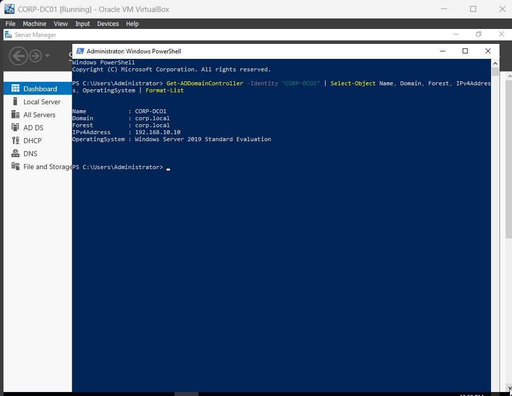
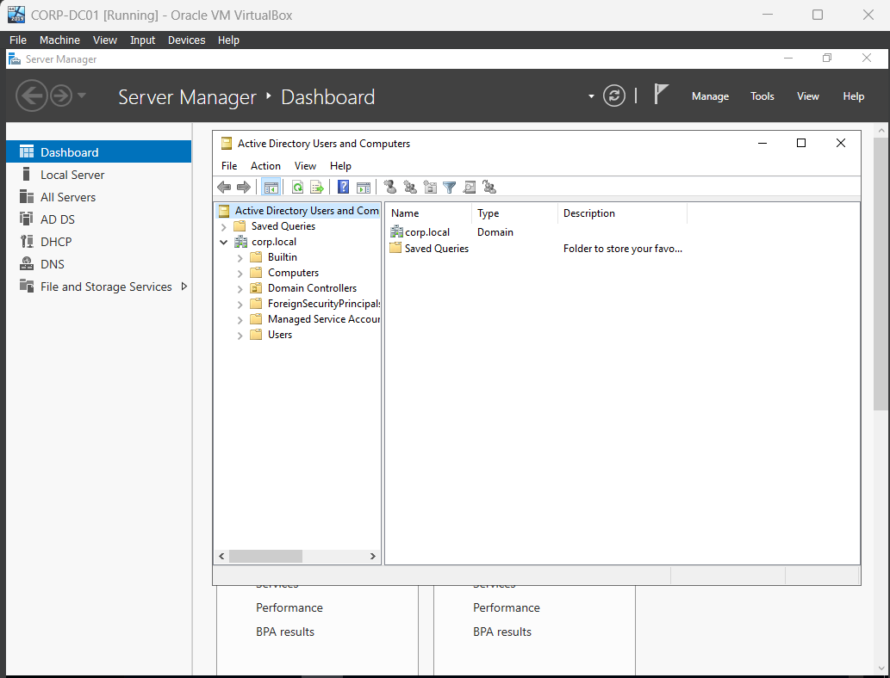
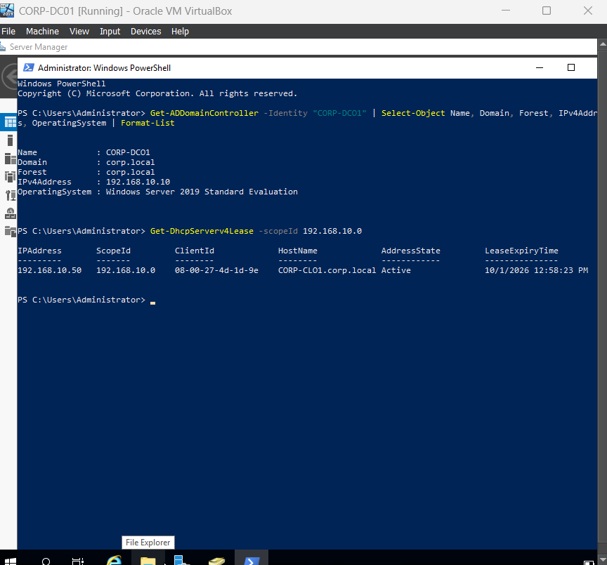
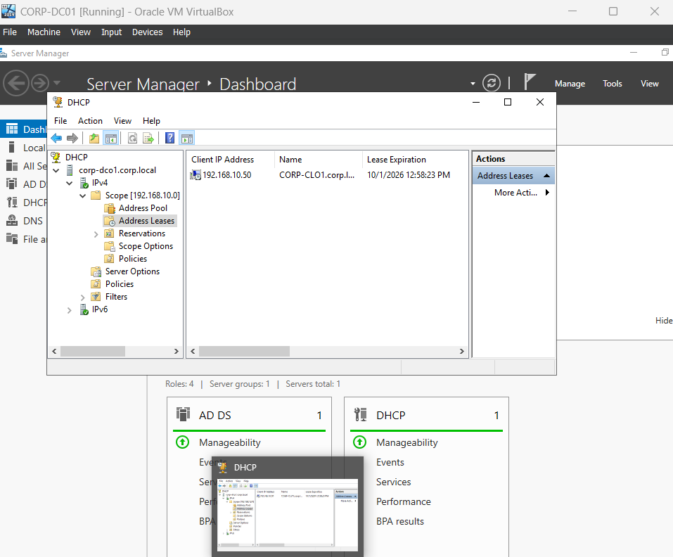
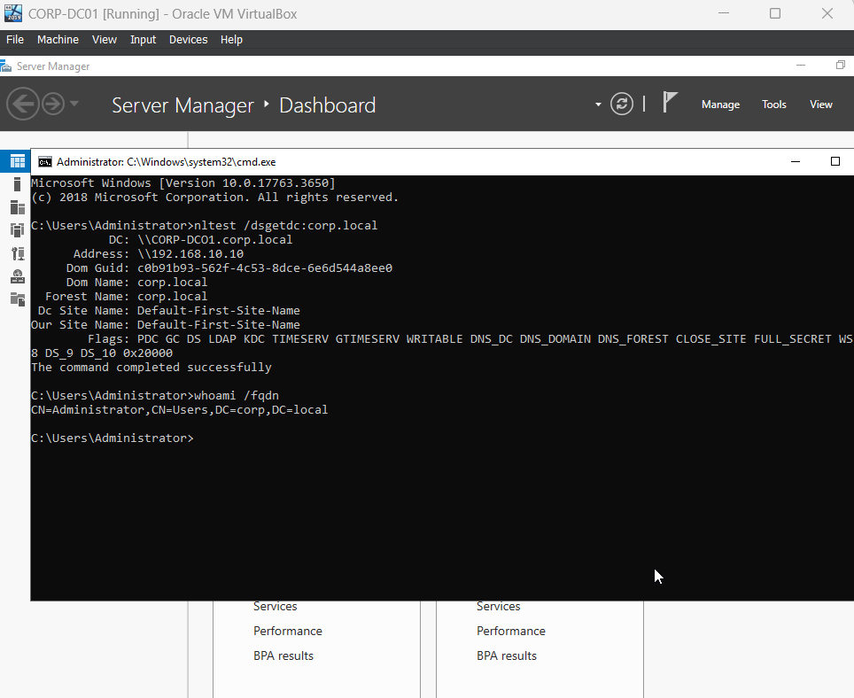
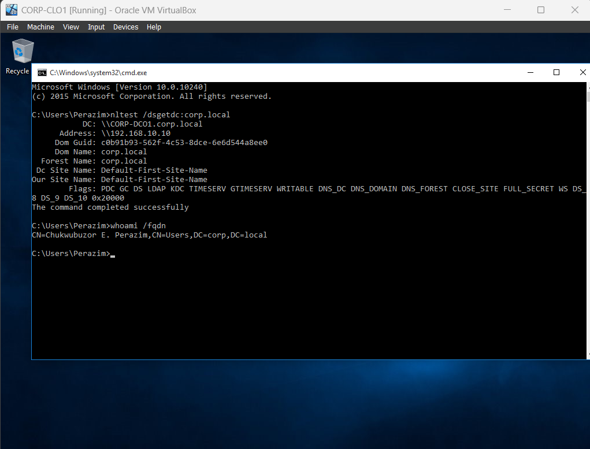

# Enterprise Windows Server 2019 Lab: Active Directory Domain Services (AD DS), Centralized DNS & DHCP Deployment

[](https://www.microsoft.com/evalcenter/evaluate-windows-server-2019)
[](https://www.microsoft.com/evalcenter/evaluate-windows-10-enterprise)
[](https://learn.microsoft.com/windows-server/identity/ad-ds/active-directory-domain-services)
[](https://learn.microsoft.com/windows-server/networking/technologies/dns/dns-top)
[](https://www.virtualbox.org/)
[](https://github.com/ChukwubuzorPerazim)

---

## 1. Executive Summary & Project Overview

This project documents the end-to-end design, implementation, and verification of an enterprise-grade **Active Directory Domain Services (AD DS)** environment running on **Windows Server 2019 Standard Edition**, alongside centralized **DNS** and dynamic **DHCP** services.

In corporate environments, centralized identity governance, authoritative name resolution, and standardized network configuration are essential requirements for infrastructure availability and security. This deployment establishes an isolated enterprise corporate network (`corp.local`), centralizes authentication, isolates administrative control, standardizes IP address allocation, and secures client endpoint integration.

### Key Objectives Accomplished:
* **Hypervisor Network Isolation:** Configured an isolated virtual private network (`192.168.10.0/24`) in Oracle VM VirtualBox, disabling hypervisor DHCP to eliminate rogue IP assignments.
* **Server Baselining:** Provisioned `CORP-DC01` (Windows Server 2019 Standard Evaluation, 2 GB RAM, 1 vCPU, 20 GB VHD) with static IP parameters and hostname configuration.
* **Role Deployment via Server Manager GUI:** Deployed Active Directory Domain Services and DNS Server roles through the native Windows Server graphical interface.
* **Forest Promotion:** Promoted `CORP-DC01` to the root Domain Controller of a new Active Directory forest (`corp.local`) with Windows Server 2016 functional levels and Global Catalog (GC) services.
* **Authoritative DNS Architecture:** Configured Forward and Reverse Lookup Zones (`10.168.192.in-addr.arpa`) with secure dynamic updates and enterprise public forwarders (`1.1.1.1` and `8.8.8.8`).
* **Active Directory Authorized DHCP:** Deployed, authorized, and activated an enterprise DHCP scope (`192.168.10.50`–`192.168.10.150`), distributing default gateway (003), DNS (006), and domain name (015) options.
* **Endpoint Join & Identity Verification:** Successfully integrated client workstation `CORP-CLO1` (Windows 10) into `corp.local`, verifying Kerberos domain authentication, DC locator discovery via `nltest`, and domain user provisioning (`CN=Chukwubuzor E. Perazim`).

---

## 2. Infrastructure Architecture & Addressing Matrix

```
+---------------------------------------------------------------------------------+
|                       VIRTUAL LAB NETWORK (192.168.10.0/24)                     |
|                                                                                 |
|   +------------------------------------+   +--------------------------------+   |
|   |         PRIMARY DOMAIN CONTROLLER  |   |        DOMAIN WORKSTATION      |   |
|   |         Hostname: CORP-DC01        |   |        Hostname: CORP-CLO1     |   |
|   |         IP: 192.168.10.10 (Static) |   |        IP: 192.168.10.50 (DHCP)|   |
|   |         OS: Windows Server 2019    |   |        OS: Windows 10 Enterprise|  |
|   |         Specs: 2GB RAM / 1 vCPU    |   |        Client MAC:             |   |
|   |         VHD: 20 GB Dynamic         |   |        08-00-27-4D-1D-9E       |   |
|   |                                    |   |                                |   |
|   |   [AD DS] Forest: corp.local       |   |   Member of: corp.local        |   |
|   |   [DNS]   Authoritative + Fwders   |   |   Identity:                    |   |
|   |   [DHCP]  Scope: 10.50 - 10.150    |   |   CN=Chukwubuzor E. Perazim    |   |
|   +------------------+-----------------+   +----------------+---------------+   |
|                      |                                      |                   |
|                      +------------------+-------------------+                   |
|                                         |                                       |
|                                  [Virtual Switch]                               |
|                       (Oracle VirtualBox Host-Only Network)                     |
+---------------------------------------------------------------------------------+
```

### Addressing & Specifications Matrix

| Hostname | Role / Services | Operating System | IP Address | Subnet Mask | Default Gateway | Primary DNS | Hardware Specs |
| :--- | :--- | :--- | :--- | :--- | :--- | :--- | :--- |
| **CORP-DC01** | Primary DC, AD DS, DNS, DHCP | Windows Server 2019 Standard | `192.168.10.10` (Static) | `255.255.255.0` | `192.168.10.1` | `127.0.0.1` (Loopback) | 2 GB RAM, 1 vCPU, 20 GB VHD |
| **CORP-CLO1** | Corporate Workstation | Windows 10 Enterprise | Dynamic (`192.168.10.50`) | `255.255.255.0` | `192.168.10.1` | `192.168.10.10` | 2.5 GB RAM, 1 vCPU, 30 GB VHD |

---

## 3. Step-by-Step Implementation Walkthrough

### Phase 1: Virtual Hypervisor & Network Isolation (VirtualBox)
1. Created an isolated virtual network in Oracle VM VirtualBox with subnet `192.168.10.0/24`.
2. **Crucial Enterprise Step:** Disabled VirtualBox's internal DHCP engine to eliminate rogue DHCP conflicts and guarantee that `CORP-DC01` functions as the sole authoritative DHCP server.

### Phase 2: Windows Server 2019 Baselining (GUI)
1. Provisioned `CORP-DC01` with 2 GB RAM, 1 vCPU, and a 20 GB dynamically allocated virtual hard disk.
2. Installed Windows Server 2019 Standard (Desktop Experience).
3. Assigned a static IPv4 address via Network Connections (`ncpa.cpl`):
   * IP Address: `192.168.10.10`
   * Subnet Mask: `255.255.255.0`
   * Default Gateway: `192.168.10.1`
   * Preferred DNS Server: `127.0.0.1` (Points to local DNS service).
4. Renamed the computer to **`CORP-DC01`** in System Properties (`sysdm.cpl`) and rebooted.

### Phase 3: AD DS Role Installation & Forest Promotion (Server Manager GUI)
1. Opened **Server Manager > Manage > Add Roles and Features**.
2. Selected **Role-based or feature-based installation** targeting `CORP-DC01`.
3. Checked **Active Directory Domain Services** (automatically installing ADUC, ADAC, and management snap-ins) and **DNS Server**. Completed the wizard.
4. Clicked the post-deployment flag notification in Server Manager and selected **"Promote this server to a domain controller"**:
   * **Deployment Operation:** Selected **Add a new forest**.
   * **Root domain name:** Entered `corp.local`.
   * **Domain Controller Options:** Set Forest and Domain functional levels to **Windows Server 2016** (standard functional baseline for Windows Server 2019).
   * Verified **Domain Name System (DNS) server** and **Global Catalog (GC)** were selected.
   * Configured the **Directory Services Restore Mode (DSRM)** administrator password.
   * Confirmed the NetBIOS domain name generated as **`CORP`**.
   * Retained default database paths (`C:\Windows\NTDS` for NTDS.dit/logs and `C:\Windows\SYSVOL`).
5. Passed all prerequisite checks and clicked **Install**. The server rebooted automatically upon promotion.

### Phase 4: DNS Server Configuration (DNS Manager GUI)
1. Opened **DNS Manager** (`dnsmgmt.msc`).
2. Confirmed the authoritative Forward Lookup Zone `corp.local` with operational SRV records (`_ldap`, `_kerberos`).
3. Created an **IPv4 Reverse Lookup Zone**:
   * Type: Primary Zone > Store in Active Directory.
   * Replication: To all DNS servers in `corp.local`.
   * Network ID: `192.168.10`.
   * Dynamic Updates: Selected **Allow only secure dynamic updates**.
4. Configured Public Forwarders:
   * Right-clicked `CORP-DC01` > **Properties > Forwarders** tab > Clicked **Edit**.
   * Added Cloudflare (`1.1.1.1`) and Google (`8.8.8.8`) to ensure external name resolution.

### Phase 5: DHCP Scope Deployment & AD Authorization (DHCP GUI)
1. In Server Manager, installed the **DHCP Server** role.
2. Completed the post-install task to **Authorize** the DHCP server in Active Directory using domain admin credentials (`corp.local\Administrator`).
3. Opened **DHCP Management Console** (`dhcpmgmt.msc`):
   * Expanded `corp-dco1.corp.local` > Right-clicked **IPv4 > New Scope...**
   * Scope Name: `Scope [192.168.10.0]`
   * IP Address Range: Start IP `192.168.10.50` | End IP `192.168.10.150` | Subnet Mask `255.255.255.0` (/24).
   * Exclusions: Preserved `192.168.10.1`–`192.168.10.49` for static infrastructure devices.
   * Lease Duration: Standard 8 days.
   * Configured Options:
     * Router (003): `192.168.10.1`
     * DNS Servers (006): `192.168.10.10`
     * Domain Name (015): `corp.local`
   * Activated scope immediately.

### Phase 6: Client Workstation Deployment & Domain Integration
1. Provisioned workstation `CORP-CLO1` (Windows 10 Enterprise) attached to `LabNetwork`.
2. Verified automated IP assignment (`192.168.10.50`) and DNS (`192.168.10.10`) via DHCP.
3. Joined `CORP-CLO1` to `corp.local` via System Properties (`sysdm.cpl`), authenticated with domain administrative credentials, and restarted upon receiving *"Welcome to the corp.local domain"*.
4. Created domain user account **`Chukwubuzor E. Perazim`** in Active Directory (`CN=Users,DC=corp,DC=local`) and validated interactive domain logon.

---

## 4. Verification & Testing Evidence

All tests below were executed and captured directly from the live VirtualBox lab environment.

### Test 1: Active Directory Domain Controller Health & Forest Configuration
Executed on `CORP-DC01` via elevated PowerShell to confirm domain operational status, IP binding, and OS build:

```powershell
Get-ADDomainController -Identity "CORP-DC01" | Select-Object Name, Domain, Forest, IPv4Address, OperatingSystem | Format-List
```

```text
Name            : CORP-DC01
Domain          : corp.local
Forest          : corp.local
IPv4Address     : 192.168.10.10
OperatingSystem : Windows Server 2019 Standard Evaluation
```


*Figure 1: PowerShell query on CORP-DC01 validating domain controller identity, forest root, IPv4 binding, and Windows Server 2019 Standard Evaluation.*

---

### Test 2: Active Directory Users and Computers (ADUC) Hierarchy
Inspected the Active Directory database partition (`corp.local`) via Microsoft Management Console (`dsa.msc`):


*Figure 2: Active Directory Users and Computers snap-in displaying the domain tree, built-in security containers, Computers, Domain Controllers, and Users partitions.*

---

### Test 3: Dynamic DHCP Lease Allocation (PowerShell & GUI Evidence)
Validated that workstation `CORP-CLO1` dynamically acquired its IP lease from the `192.168.10.0/24` scope:

**PowerShell Output:**
```powershell
PS C:\Users\Administrator> Get-DhcpServerv4Lease -scopeId 192.168.10.0

IPAddress       ScopeId         ClientId            HostName                AddressState    LeaseExpiryTime
---------       -------         --------            --------                ------------    ---------------
192.168.10.50   192.168.10.0    08-00-27-4d-1d-9e   CORP-CLO1.corp.local    Active          10/1/2026 12:58:23 PM
```


*Figure 3: Active DHCP lease retrieved via PowerShell showing client IP 192.168.10.50, client MAC (08-00-27-4D-1D-9E), and hostname CORP-CLO1.corp.local.*

**DHCP Management GUI Output:**


*Figure 4: DHCP Management Console showing active lease under Scope [192.168.10.0] > Address Leases.*

---

### Test 4: Domain Controller Discovery & Identity Resolution on CORP-DC01
Executed DC locator diagnostics and distinguished name resolution on the Primary Domain Controller:

```cmd
C:\Users\Administrator>nltest /dsgetdc:corp.local
        DC: \\CORP-DC01.corp.local
   Address: \\192.168.10.10
  Dom Guid: c0b91b93-562f-4c53-8dce-6e6d544a8ee0
  Dom Name: corp.local
Forest Name: corp.local
Dc Site Name: Default-First-Site-Name
Our Site Name: Default-First-Site-Name
       Flags: PDC GC DS LDAP KDC TIMESERV GTIMESERV WRITABLE DNS_DC DNS_DOMAIN DNS_FOREST CLOSE_SITE FULL_SECRET WS_0x20000
The command completed successfully

C:\Users\Administrator>whoami /fqdn
CN=Administrator,CN=Users,DC=corp,DC=local
```


*Figure 5: Elevated command prompt on CORP-DC01 demonstrating successful DC locator query (nltest) and FQDN resolution.*

---

### Test 5: Client Workstation Domain Join & User Authentication
Executed from client workstation `CORP-CLO1` (Windows 10, Build 10.0.10240) logged in as domain user **`Chukwubuzor E. Perazim`**:

```cmd
C:\Users\Perazim>nltest /dsgetdc:corp.local
        DC: \\CORP-DC01.corp.local
   Address: \\192.168.10.10
  Dom Guid: c0b91b93-562f-4c53-8dce-6e6d544a8ee0
  Dom Name: corp.local
Forest Name: corp.local
Dc Site Name: Default-First-Site-Name
Our Site Name: Default-First-Site-Name
       Flags: PDC GC DS LDAP KDC TIMESERV GTIMESERV WRITABLE DNS_DC DNS_DOMAIN DNS_FOREST CLOSE_SITE FULL_SECRET WS_0x20000
The command completed successfully

C:\Users\Perazim>whoami /fqdn
CN=Chukwubuzor E. Perazim,CN=Users,DC=corp,DC=local
```


*Figure 6: Domain verification from client CORP-CLO1 confirming domain controller connectivity across the virtual switch, Kerberos ticket acquisition, and authenticated domain user context (CN=Chukwubuzor E. Perazim).*

---

## 5. Security & Engineering Considerations

1. **DNS Architecture & DC Loopback Binding:**  
   The primary DNS server on `CORP-DC01` is bound to `127.0.0.1`. This ensures the local Netlogon service queries the authoritative local DNS database for essential Active Directory service records (`_ldap._tcp.dc._msdcs.corp.local`) before attempting external resolution.
2. **Active Directory Authorized DHCP Protection:**  
   In Windows enterprise domains, rogue DHCP servers can introduce Man-in-the-Middle (MitM) hazards. The DHCP service on `CORP-DC01` was formally authorized in Active Directory; unauthenticated DHCP services on the same subnet will automatically halt.
3. **Hardware Resource Optimization:**  
   `CORP-DC01` was provisioned with a lean footprint (2 GB RAM, 1 vCPU, 20 GB dynamically expanding VHD). This delivers high performance for core domain services while leaving host resources available for client workstations.
4. **Subnet Separation & Infrastructure Reservation:**  
   Dynamic IP leases were restricted to `192.168.10.50`–`192.168.10.150`. Subnet addresses `192.168.10.1` through `192.168.10.49` are strictly reserved for static infrastructure devices (Domain Controllers, future secondary DCs, firewalls, and managed switches).

---

## 6. Real-World Engineering Troubleshooting Log

| Issue / Symptom | Root Cause Analysis | Engineering Resolution |
| :--- | :--- | :--- |
| Workstation received IP from incorrect subnet (`10.0.2.x`). | VirtualBox internal DHCP server remained enabled on the default host network adapter. | Disabled VirtualBox internal DHCP via VirtualBox Network Manager; forced client adapter release and renew (`ipconfig /renew`). |
| Client unable to locate Domain Controller during join (`0x0000232B RCODE_NAME_ERROR`). | Client was querying public ISP DNS instead of the domain controller DNS service. | Configured DHCP Scope Option 006 (DNS Servers) with `192.168.10.10` and flushed client resolver cache (`ipconfig /flushdns`). |

---

## 7. Author & Contact Information

* **Engineer:** Chukwubuzor Perazim
* **Specialization:** Network Security, Windows Server Infrastructure & Command and Control (C3) Systems
* **Location:** Warri, Delta State, Nigeria
* **LinkedIn:** [linkedin.com/in/ChukwubuzorPerazim](www.linkedin.com/in/chukwubuzor-perazim-590a5519a)
* **Email:** chukwubuzorperazim@gmail.com
* **GitHub:** [github.com/ChukwubuzorPerazim]([https://github.com/ChukwubuzorPerazim](https://github.com/Perazimy))
